# Project-Name: cosmetic-product-app-grp1-icp7

---
# Project-Title:  COSMETIC PRODUCT APP 

---
Welcome to COSMETIC PRODUCT APP Project . 
**COSMETIC PRODUCT APP** ,where you will get to know the every product detailed information.
Popularized through customer relationships with some of the world’s most recognizable faces.

This Project is simply made by using ReactJS. Weather you are Beginner Student to coding or Web Development this repository will be your go to resource for HTML, CSS and ReactJS.

---
## Features
1. High Quality Products
2. Natural and Organic Ingredients
3. Eco-Friendly Packaging
4. Dermatologically Tested
5. Comprehensive Skincare
---
### Home Page
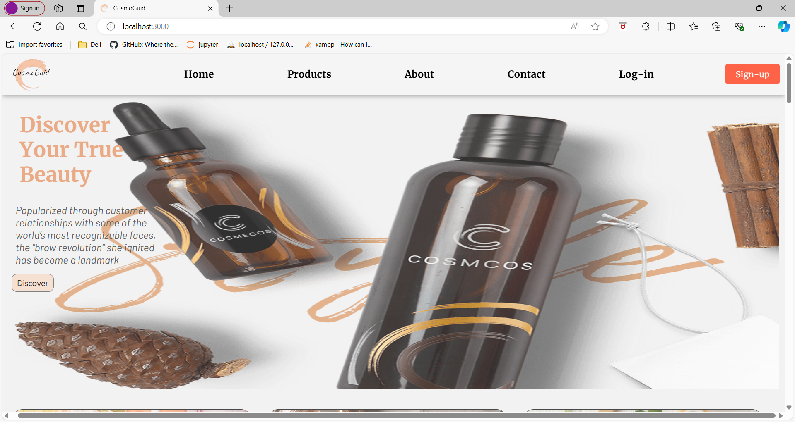
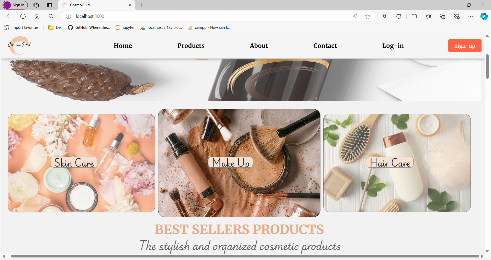
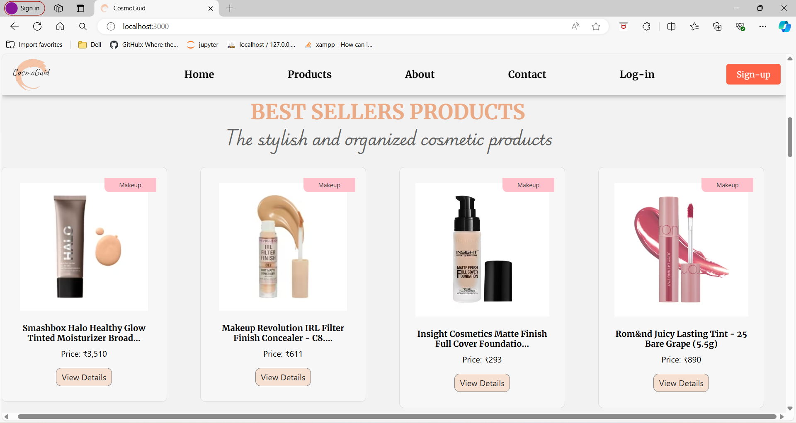
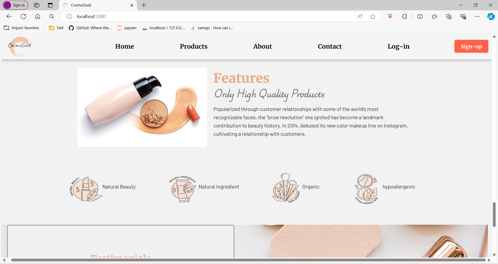
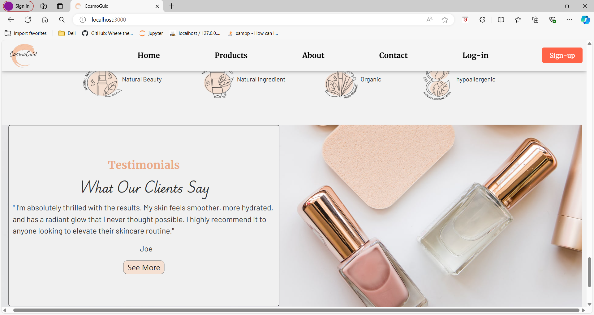
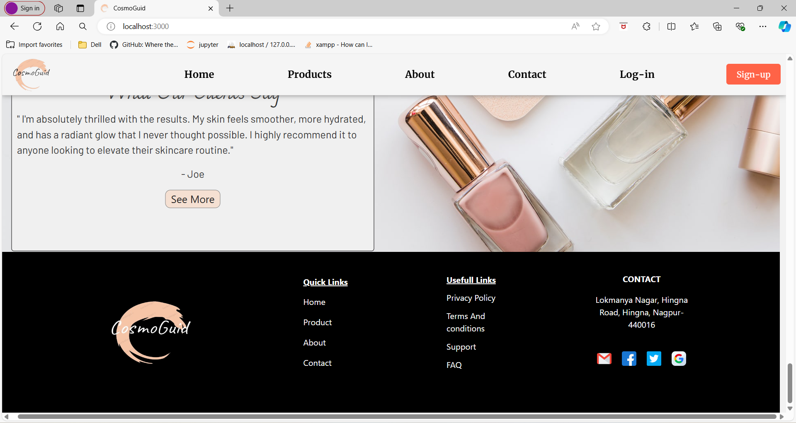
---
### About Page
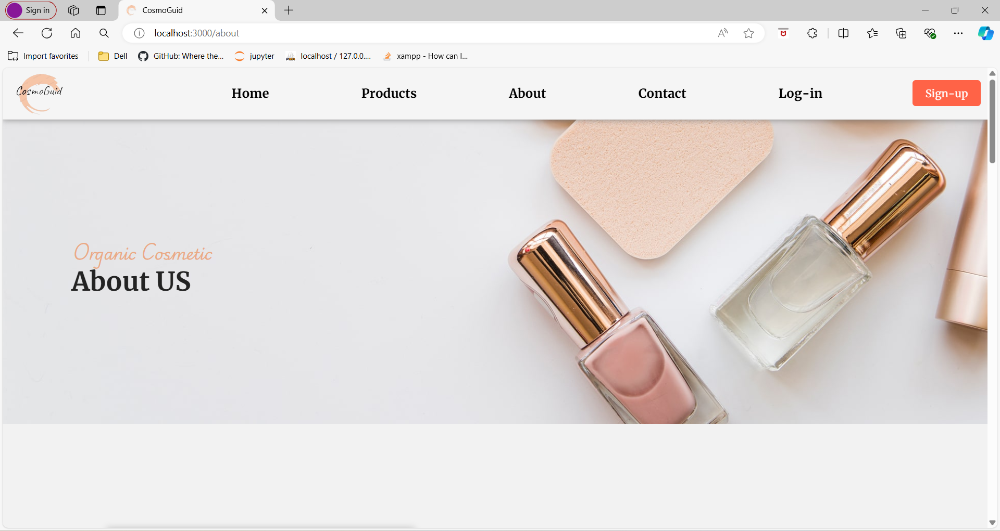
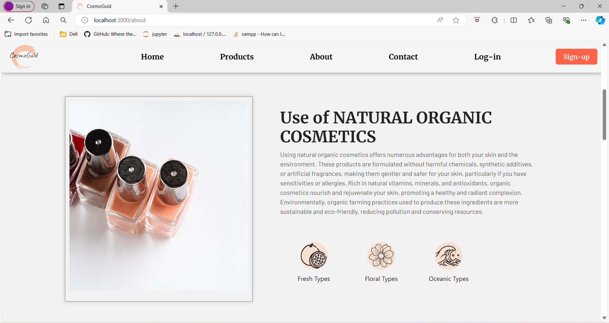
---
### Products Page
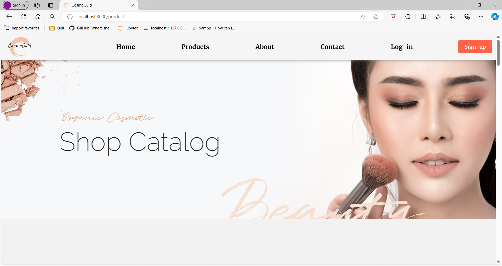
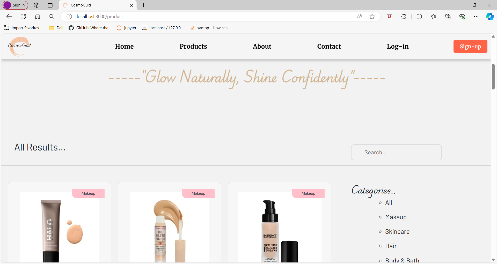
---
### Contact Page
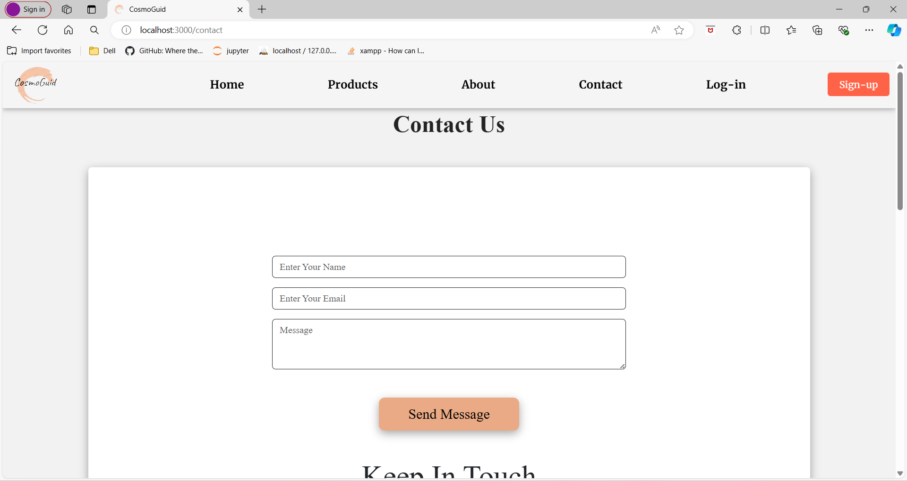
---

## How to Contribute 🪴💻

We welcome contributions from the community to help us expand and improve this handbook if you would like to contribute follow the steps:

1. Fork the repository to your GitHub account.
2. Make your changes ,add new content or fix the existing issues.
3. Open pull request in this repository.

---
## Contributors

